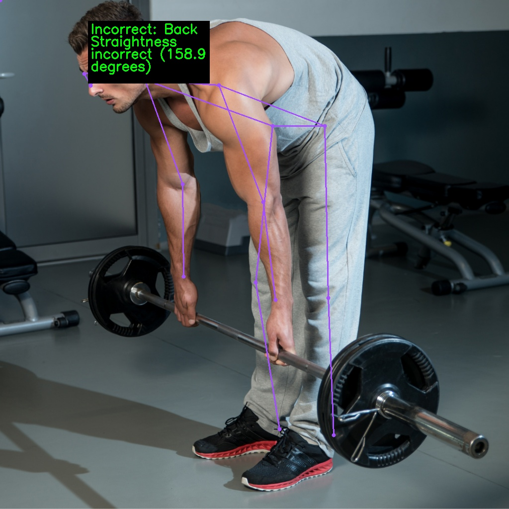
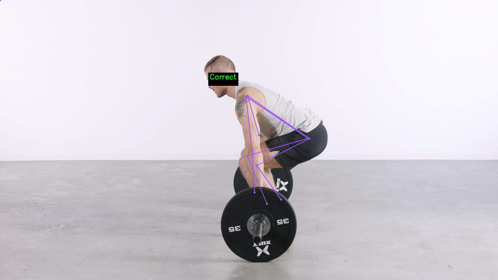

# Correct Pose Detection

A computer vision tool to detect and analyze human posture for workplace safety and ergonomics assessment.

## Description

This project uses pose estimation technology to analyze body posture in images and videos, providing real-time feedback on ergonomic issues. The system is designed to help prevent workplace injuries by identifying incorrect postures and suggesting corrections based on established ergonomic guidelines.

## Features

- Real-time pose detection and analysis
- Support for both image and video inputs
- Apply customizable rules to check pose correctness
- Save annotated output as images or videos
- Visual feedback with annotations showing pose issues

## Installation
### Setup

1. Clone the repository:
   ```
   git clone https://github.com/spabhijna/Correct_Pose_Detection.git
   cd Correct_Pose_Detection
   ```

2. Install dependencies:
   ```
   pip install uv
   uv venv .venv
   source .venv/bin/activate
   uv install
   
   ```
3. Download the YOLOv8 pose model:
   Download YOLOv8s-pose.pt to the models directory
   ```
   mkdir -p models
   ```

## Project Structure

```
Correct_Pose_Detection/
├── src/
│   ├── check_pose.py     # Pose analysis algorithms
│   ├── main.py           # Main application entry point
│   ├── model.py          # Pose detection model wrapper
│   ├── utils.py          # Utility functions
│   └── visualizer.py     # Visualization tools
└── pyproject.toml        # Project details with dependencies
└── README.md             # Project documentation
```

## Usage

### Basic Usage

Process an image or video file:

```
python src/main.py path/to/your/input/img/video
```

### Display Results

To display the processed results:

```
python src/main.py path/to/your/input/file --display
```

### Adjust Display Scale

For better visibility on high-resolution screens:

```
python src/main.py path/to/your/input/file --display --scale 2
```

### Using Custom Configuration Files

Specify a custom configuration file for pose analysis:

```
python src/main.py path/to/your/congfig_file path/to/your/input/file --display
```

## Configuration File Format

The system uses JSON configuration files to define rules for pose analysis. Here's the structure and supported rule types:

```json
{
  "rules": [
    {
      "type": "angle",
      "name": "Back Angle",
      "keypoints": ["hip", "shoulder", "Vertical"],
      "threshold": {
        "max": 20
      }
    },
    {
      "type": "distance",
      "name": "Foot Spacing",
      "keypoints": ["left_ankle", "right_ankle"],
      "threshold": {
        "min": 50,
        "max": 90
      }
    },
    {
      "type": "distance_ratio",
      "name": "Foot vs Shoulder Width",
      "pairs": [
        ["left_ankle", "right_ankle"],
        ["left_shoulder", "right_shoulder"]
      ],
      "threshold": {
        "min": 0.6,
        "max": 1.2
      }
    },
    {
      "type": "angle_between_vectors",
      "name": "Hip Twist",
      "vectors": [
        ["left_hip", "right_hip"],
        ["left_shoulder", "right_shoulder"]
      ],
      "threshold": {
        "max": 10
      }
    }
  ]
}
```

### Rule Types

1. **angle**: Measures the angle between three keypoints
   - Specify three keypoints in order (use "Vertical" for a vertical reference)
   - Example: `["hip", "shoulder", "Vertical"]` measures the angle between hip-shoulder and a vertical line

2. **distance**: Measures the distance between two keypoints
   - Specify two keypoints
   - Example: `["left_ankle", "right_ankle"]` measures the distance between ankles

3. **distance_ratio**: Compares the ratio between two distances
   - Specify two pairs of keypoints
   - Example: Ratio of ankle width to shoulder width

4. **angle_between_vectors**: Measures the angle between two vectors
   - Specify two vectors, each defined by two keypoints
   - Example: Angle between hip alignment and shoulder alignment

### Thresholds

Thresholds can be specified using:
- **min**: Minimum acceptable value
- **max**: Maximum acceptable value
- Both min and max for a range

## Example Input and Output

Below is an example showing how the system analyzes posture in a workplace setting:

### Incorrect Pose




### Correct Pose




*Annotated output showing detected keypoints and ergonomic assessment*


The annotated output displays these issues directly on the image, with green text for incorrect postures helping workers and supervisors identify and correct ergonomic problems in real-time.

## How It Works

1. **Pose Detection**: Uses YOLOv8 to detect human body keypoints in images or video frames
2. **Ergonomic Analysis**: Analyzes the detected keypoints according to rules defined in the configuration file
3. **Visualization**: Annotates the input media with visual feedback and ergonomic assessments
4. **Output**: Saves the annotated results and optionally displays them in real-time

## Contributing

Contributions are welcome! Please feel free to submit a Pull Request.

## Acknowledgments

- The project uses YOLOv8 from Ultralytics for pose estimation
- Supervision library for visualization helpers